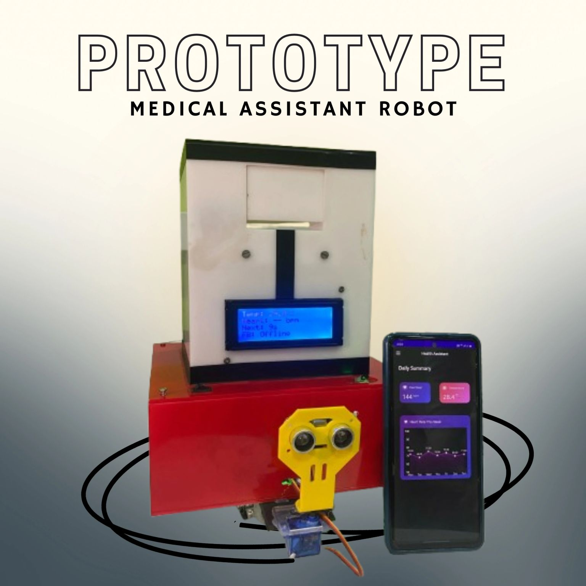
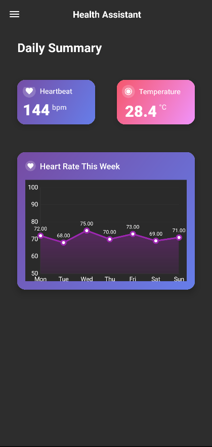
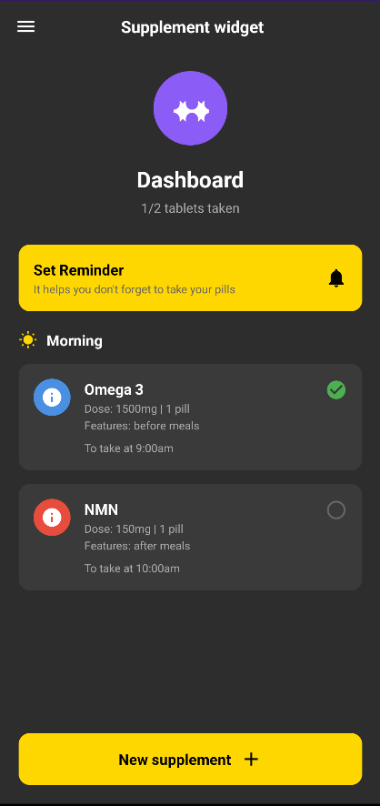
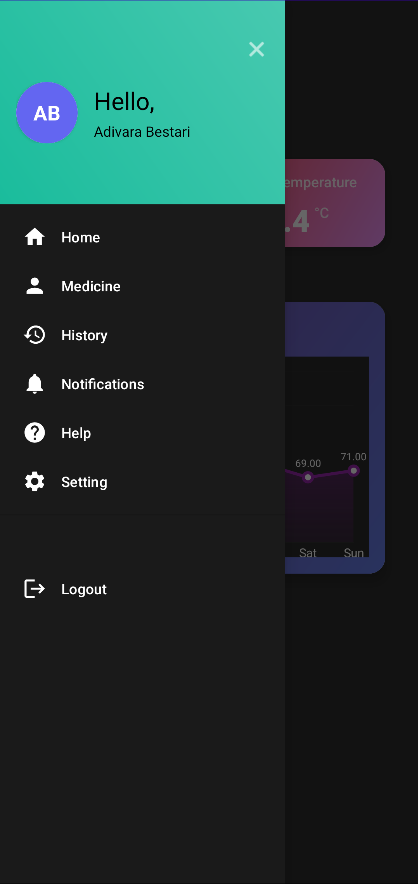

# Medical-Assistance-Robot-and-Application-IoT-Project

An IoT Project where we created a medical assistance robot and a mobile application for it as well.

LinkedIn Post Link: https://www.linkedin.com/posts/shuaib-naufel01_medicalrobotics-iotproject-healthcaretechnology-activity-7348385873765285888-iuHm?utm_source=social_share_send&utm_medium=member_desktop_web&rcm=ACoAAFeLMekBZKp2yMOhE5HDwG9tKW6a_0BT-1w

This is a group project which we did for our Internet Of Things project at university. It is a medical assistance robot with
an Application to help with medication, tracking etc.

Robot Features:

- Medical Robot that comes to the patient via a line to follow using IR Sensors, and will also avoid any objects that are in the way when it is time to take their medication.
- When arrived to patient, a buzzer will go iff incase patient is sleeping and a tray opens with the medication for the patient to take.
- Temperature and heart rate sensors are placed on the robot where the patient can keep their thumb and both temperature and
  heart rate will be checked.
- If temperature or heart rate is above normal levels, a buzzer will go off and an alert will be sent to the caretakers application.
- After medicine is given to the patient, the robot will travel back to its starting position.

Application Features:

- Application contains a Home page which shows the live data of the temperature and heart rate when scanned, showing any changes that occur
  live.
- A reminder adder where caretaker can add reminders for themselves just incase they forget
- Adding medicine that the patient takes, other than the usual medicine they are prescribed to take to ensure full documentation for safety.
- A history page showing all the additional medication that the patient has taken.

Medical Assistance Robot:

Home Page:

Dashboard:

